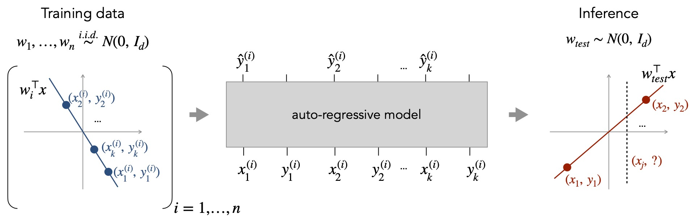
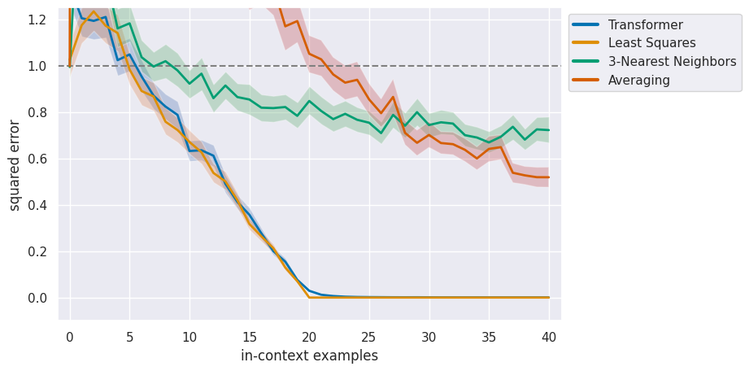

# In-context learning regression


## Table of contents
* [General info](#general-info)
* [Setup](#setup)
* [Code structure](#code-structure)
* [Credits](#credits)

## General info
This repository contains the code for the "in-context learning regression" project. It allows you to evaluate our trained models, reproduce our results and train new models. As an example, you can replicate the plot investigating the closeness of the posterior mean-based estimator and Transformer.

	
## Setup

You can start by cloning our repository and following the steps below.

1. Install the dependencies for our code using Conda. You may need to adjust the environment YAML file depending on your setup.

    ```
    conda env create -f environment.yml
    conda activate in-context-learning
    ```

2. Download [model checkpoints](https://github.com/dtsip/in-context-learning/releases/download/initial/models.zip) and extract them in the current directory.

    ```
    wget https://github.com/lucarossi9/in-context-learning/releases/download/initial/models.zip
    unzip models.zip
    ```

3. [Optional] If you plan to train, populate `conf/wandb.yaml` with the information regarding your wandb account. use the yaml files in the `conf` folder to select the task, the models and their parameters.

## Code structure
* `src` - Folder containing the implementation.
  * `conf` - Contains yaml files for model/task configuration.
  * `base_models.py` - Contains some of the base models.
  * `check_flops.py` - Allows to count the flops of a model.
  * `curriculum.py` - Implements the curricula.
  * `eval.py` -Implements the evaluation of trained models.
  * `models.py` -Contains models.
  * `plot_utils.py` - Plots functions.
  * `results.ipynb` - Allows for loading models, reproducing plots and training new models.
  * `samplers.py` - Allows for sampling the inputs.
  * `tasks.py` - Allows for sampling the task.
  * `train.py` - Allows for training Transformer for linear regression.
  * `train_tensor_pca.py` - Allows for training Transformer for tensor_PCA.
  * `train_mixtures.py` - Allows for training Transformer for mixtures of Bernoulli.
  * `utilities_mixtures.py` - Contains utility function for mixture of Bernoulli problem.
  * `utils.py` - Contains general utility functions.
  * `requirements.txt` - Requirements file.

To learn how to reproduce results or train new models follow the tutorial in `results.ipynb` notebook. If you want to change the configuration of our model, modify the corresponding files in the `conf` folder.

## Credits

* Our codes are in part borrowed by the work
*What Can Transformers Learn In-Context? A Case Study of Simple Function Classes** <br>
*Shivam Garg\*, Dimitris Tsipras\*, Percy Liang, Gregory Valiant* <br>
Paper: http://arxiv.org/abs/2208.01066 <br><br>
```bibtex
    @misc{garg2023transformers,
      title={What Can Transformers Learn In-Context? A Case Study of Simple Function Classes}, 
      author={Shivam Garg and Dimitris Tsipras and Percy Liang and Gregory Valiant},
      year={2023},
      eprint={2208.01066},
      archivePrefix={arXiv},
      primaryClass={cs.CL}
}
```

* Thanks to the TML lab for the amazing supervision during the project.

